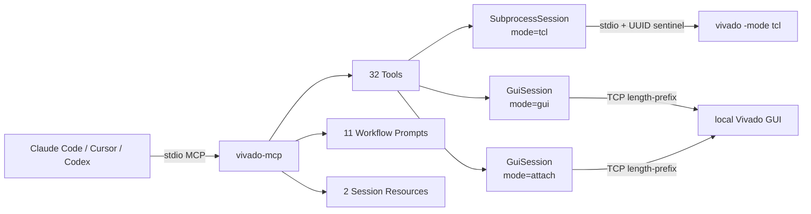

# vivado-mcp

[](https://pypi.org/project/vivado-mcp/)
[](https://pypi.org/project/vivado-mcp/)
[](LICENSE)
[](https://github.com/mapleleavessssssss-wq/vivado-mcp/actions/workflows/ci.yml)

**让 Claude Code、Cursor、Codex 等 AI Agent 安全驱动本地 Xilinx Vivado。**

32 个 MCP 工具覆盖会话、综合、实现、时序、CDC、XDC、IP、波形与烧录。可保存结构化时序结果、比较两次测量、离线查询 VCD 中的未知值与握手事件；通用 Vivado 操作由 `run_tcl` 承载。

| 32 个精选工具 | 11 个工作流 Prompt + 5 个 Skills | 2 个实时 Resources | GUI / Tcl / attach 三种会话 |
|---:|---:|---:|---:|

> 本项目控制的是**你本机安装的 Vivado**，不是云端综合服务。命令在当前用户权限下执行；工具说明和诊断建议以中文为主。
>
> **English:** A local Vivado MCP server with 32 tools, structured timing evidence and baseline comparison, bounded offline VCD queries, 11 workflow prompts, and 5 reusable skills.

**导航**：[快速开始](#快速开始) · [实际调试场景](#实际调试场景) · [工具设计](#工具设计) · [工作流 Prompts](#工作流-prompts) · [工具列表](#工具列表) · [调试指南与 Skills](docs/DIAGNOSTICS_GUIDE.md) · [CLI](#cli-参考) · [反馈](#反馈与-bug-提交)

## 环境要求

- **Python ≥ 3.10**，Windows / Linux
- **Xilinx Vivado**：必须安装在运行 vivado-mcp 的本机
- **MCP Python SDK 2.x**：唯一直接运行时依赖，`pip` 会自动安装

| Vivado 版本 | 支持等级 | 验证范围 |
|---|---|---|
| 2019.1 | **主要支持基线** | 作者长期实测 GUI / Tcl / attach 与完整 FPGA 流程 |
| 2018.3 | **部分路径验证** | 社区贡献者验证 IPDEF-only IP 元数据（[PR #1](https://github.com/mapleleavessssssss-wq/vivado-mcp/pull/1)） |
| 2022.2 | **社区现场验证** | Windows 10 GUI/XSim 问题现场（[Issue #2](https://github.com/mapleleavessssssss-wq/vivado-mcp/issues/2)），不代表完整回归 |
| 其他版本 | **实验性兼容** | 协议层为纯 Tcl，但未持续做真机矩阵；请先跑下方冒烟验证 |

## 快速开始

### 1. 安装

```bash
python -m pip install vivado-mcp
```

多 Python 环境下，请让 MCP 客户端使用同一个 Python 解释器；必要时把下方配置中的 `python` 换成该解释器的绝对路径。

### 2. 先运行环境诊断

```bash
vivado-mcp doctor
```

`doctor` 默认完全只读，检查 Vivado 路径、init Tcl 注入、9999 端口协议、Claude Code/Codex 配置，并给出精确的修复计划。CI 或 Agent 可使用结构化输出：

```bash
vivado-mcp doctor --json
```

### 3. 注入 Vivado（一次性）

```bash
vivado-mcp install
```

这会修改你 Vivado 的 `Vivado_init.tcl`，让以后启动 GUI 时自动开启 TCP server（绑定 install 指定的单一端口，默认 9999；被占即退出，不会滑动到其他端口）。**原文件会备份**，`vivado-mcp uninstall` 可恢复。

如果 Vivado 装在受保护目录（如 `C:\Program Files\`），用管理员身份运行命令即可。

也可以让 doctor 执行安全修复：

```bash
vivado-mcp doctor --fix --client all
```

`--fix` 才会写文件：复用幂等的 Vivado 注入，并在备份后原子更新选定客户端配置；不会删除第三方注入、终止占用端口的进程或自动升级软件。

### 4. 配置 MCP 客户端

`doctor --fix` 可自动配置 Claude Code 和 Codex。手动配置时，Claude Code 使用 `~/.claude.json`，Cursor 使用项目级 `.cursor/mcp.json` 或用户级 `~/.cursor/mcp.json`；两者都在 `mcpServers` 中加入：

```json
"vivado": {
  "command": "python",
  "args": ["-m", "vivado_mcp"],
  "env": {
    "VIVADO_PATH": "D:/Xilinx/Vivado/2019.1/bin/vivado.bat"
  },
  "type": "stdio"
}
```

Codex 使用 `~/.codex/config.toml`：

```toml
[mcp_servers.vivado]
command = "python"
args = ["-m", "vivado_mcp"]

[mcp_servers.vivado.env]
VIVADO_PATH = "D:/Xilinx/Vivado/2019.1/bin/vivado.bat"
```

> 将 `VIVADO_PATH` 替换为你的 Vivado 实际路径：
> - **Windows**: `"D:/Xilinx/Vivado/2019.1/bin/vivado.bat"`
> - **Linux**: `"/opt/Xilinx/Vivado/<版本>/bin/vivado"`
> - 也可以不设置 `VIVADO_PATH`，将 Vivado `bin` 目录加入系统 `PATH`。
>
> `VIVADO_PATH` 负责让 MCP server 找到 Vivado 可执行文件；上一步的 `vivado-mcp install` 负责给 GUI/attach 模式注入 TCP server。其他支持 stdio MCP 的客户端使用相同的 `command`、`args` 和 `env`，配置文件位置以客户端文档为准。

### 5. 重启 MCP 客户端

配置完成后重启客户端，即可加载 32 个工具、11 个工作流 Prompt 和 2 个会话状态 Resource。五个 [Skills](skills/) 已随 Python 包分发，可显式导出到自选目录；不会自动修改客户端配置。对应 Prompt 从同一正文读取。

### 6. 冒烟验证

在客户端中发送：

```text
启动一个 GUI 会话，然后执行 Tcl: version -short
```

AI 应依次调用 `start_session(mode="gui")` 和 `run_tcl("version -short")`。成功时 Vivado GUI 会启动（已有注入服务则直接 attach），并返回版本号。失败时直接运行 `vivado-mcp doctor`，无需逐项猜配置。

若 MCP 启动 GUI 时出现“进程提前退出”或连接超时，先查看错误中列出的
**Vivado 启动日志**和 **Launcher 日志**。启动器的错误可能发生在 Vivado
日志创建之前，因此两份都需要检查。日志默认位于系统临时目录的
`vivado-mcp/logs`，可用 `VIVADO_MCP_LOG_DIR` 指定目录；成功后也可从
`list_sessions` 的 `startup_log` / `launcher_log` 字段找到路径。
这些文件会继续记录该 GUI 进程的输出，关闭会话后保留，便于后续诊断。

如果手动打开同一 Vivado 能正常工作，可先完成上述 `install` 注入，再手动启动
GUI，使用 `start_session(mode="attach", port=9999)` 连接；安装时使用自定义
端口的，填写该端口。attach 不会新建 GUI 或本次启动日志。提交问题时请附上
版本、手动启动对照结果和相关错误片段，单独一个退出码不足以确定原因。

<details>
<summary>从源码安装（开发/贡献）</summary>

```bash
git clone https://github.com/mapleleavessssssss-wq/vivado-mcp.git
cd vivado-mcp
pip install -e ".[dev]"
```
</details>

各版本的完整变更和迁移说明见 [CHANGELOG](CHANGELOG.md)。

## 实际调试场景

| 你想解决的问题 | 使用方式 | 得到什么 |
|---|---|---|
| 修改 RTL 后，时序到底变了多少？ | `get_timing_report(output_format="json")`，保存结果后在下一轮传 `baseline_file` | setup / hold / pulse-width 指标、设计阶段、同阶段可比指标的差值；不会把综合估算当成最终验收 |
| 同事只发来一份时序报告 | `get_timing_report(report_file="reports/timing.rpt", output_format="json")` | 无需 Vivado 会话即可分析；报告的来源、缺失字段与未验证项明确列出 |
| 仿真某处出现 X/Z，或握手是否发生？ | `query_waveform(file_path="sim/trace.vcd", ...)` | 信号层次、时间窗内变化、未知值与条件匹配；输出数量有上限 |
| 拿到 CDC 报告，想定位跨域风险 | `get_cdc_report(report_file="reports/cdc.rpt")` | 时钟对、规则和严重级别、明细、豁免与缺失证据；不凭零告警宣称签核 |
| 接手陌生工程，不知道从哪开始 | [工程接管 Skill](skills/vivado-project-bringup/SKILL.md) | 环境与工程摸底、首个阻塞问题、后续工具调用路线 |

完整参数、可复制例子和 Skills 使用方法见 [调试指南](docs/DIAGNOSTICS_GUIDE.md)。波形查询当前支持 **VCD**；WDB/FST 请先使用相应工具导出 VCD。

## 工具设计

部分同类 Vivado MCP 采用数百个细粒度工具，其中许多只是单条 Tcl 的包装。问题是：

- 过多相似入口增加工具选择和维护成本；具体上下文开销取决于客户端如何发现、加载工具。
- 单条 Tcl 操作可直接由 `run_tcl` 或 `safe_tcl` 完成。
- 结构化分析、可靠的多步操作和离线数据处理值得提供专门入口。

本项目只保留**真正有本地价值**的工具——Tcl 做不了或做不好的事：

1. **结构化解析**：IO / 时序报告 → JSON / 中文摘要（比原始表格省 token）
2. **本地知识库**：CRITICAL WARNING 按 ID 分类 + 中文修复建议（Tcl 里写这个太难）
3. **跨命令协议**：sentinel、会话管理、超时、比特流前置安全检查
4. **跨会话工具**：`compare_xci` 纯 Python 对比两个 XCI 文件，不需要 Vivado

其他（BD / 仿真 / XSCT / 硬件调试 / IP 配置等）全部交给 `run_tcl`，让大模型自己拼 Tcl。

## 特性

- **三种会话模式**：GUI 可视化、Tcl 无头运行，以及只连接现有 GUI 的 attach
- **32 个精选工具** — 覆盖 FPGA 开发流程、智能诊断、离线解析和外部工具链联动
- **11 个证据驱动工作流** — 每个流程都要求新鲜基线、最小安全修改、复测门禁与明确停止条件
- **一条命令自检** — `doctor` 只读定位环境问题，`doctor --fix` 才执行受限、可备份的修复
- **可靠的长任务协议** — 综合/实现支持 `wait=False` 立即返回 job id，再由 `get_run_progress` 查询
- **超时响应不串台** — 每个 session 保留在途响应所有权；旧响应完成前拒绝下一命令，不会把 FIRST 的结果交给 SECOND
- **智能诊断** — 综合/实现后自动提取 CRITICAL WARNING / ERROR 分类 + 中文修复建议（含 18+ 种已知 ID）
- **IO 验证** — XDC 约束（**支持 -dict 和传统两种语法**）对比实际引脚分配，GT 端口不匹配标记为 CRITICAL
- **IP 调试** — 查询 IP 所有 CONFIG.* 参数（含 GUI 隐藏参数）、纯 Python 对比两个 XCI 文件
- **Bitstream 安全检查** — 生成比特流前自动检测 CRITICAL WARNING 并阻止（可 force 跳过）
- **结构化报告** — IO 和时序报告解析为 JSON，便于 AI 精确提取数值（**不再有"假 PASS"陷阱**）
- **安全转义** — `safe_tcl` 自动对路径/标识符做 Tcl list 转义，Windows 含空格/中文/$ 的路径也能用
- **多会话支持** — 默认复用端口 9999 的单个 GUI（不同 session_id 也 attach 同一台）；传 `port=0` 自动分配空闲端口启动独立实例；server 只绑单一端口，被占即退出不滑动

## 工作流 Prompts

Prompts 解决的是“按什么顺序做、什么证据才算完成”，不会增加工具数量。正文只在选择该 Prompt 时加载，不会全部常驻上下文。

五个可分发 Skill 与对应 Prompt 使用同一份正文。查看及导出：

```powershell
vivado-mcp skills list
vivado-mcp skills export ./fpga-skills
vivado-mcp skills export ./fpga-skills --skill vivado-cdc-audit
```

将导出的目录按客户端支持的方式导入即可。导出不覆盖已有修改：内容相同则跳过，冲突则报错，可选新目录重新导出。无需安装 SynthPilot 或 oh-my-fpga。

| Prompt | 用途 | 核心门禁 |
|---|---|---|
| `fpga_workflow` | RTL 到 bitstream 的完整流程 | 上游失败不进入下游，post-route signoff 后才写 bitstream |
| `debug_timing` | setup/hold 时序收敛 | baseline → 分类 → 最小修复 → 同指标复测，禁止假 false path |
| `debug_gt_mapping` | GT 引脚与 Lane 映射 | 原理图/XDC/实际布局三方证据一致后再改约束 |
| `debug_ip_config` | IP 参数与 XCI 漂移 | golden 来源可信、修改后 regenerate + synthesis 验证 |
| `debug_pcie` | PCIe 分层排查 | 物理 → 时钟复位 → 时序 → 协议，上一层未过不下钻 |
| `simulation_bringup` | XSim 编译、运行与失败分类 | compile 不等于 pass；必须有非零测试和新鲜运行结果 |
| `cdc_audit` | CDC crossing 审计 | 不用 waiver 隐藏真实 crossing，约束必须有结构证据 |
| `ila_hardware_debug` | ILA 插入、烧录与采波 | bit/ltx 配对、明确 JTAG target、有限等待，禁止全机 kill XSim |
| `project_bringup` | 接管或建立工程，按请求范围推进 | 静态预检、功能验证和构建逐阶段记录 |
| `waveform_debug` | 已有 VCD 离线查询与必要时导出 | 明确信号、窗口、截断与独立测试结论 |
| `constraints_authoring` | 编写或审查 XDC | 参数来自接口/板级事实，验证对象、min/max 与例外覆盖 |

## 会话模式

`start_session` 工具支持三种模式：

| mode | 效果 | 适合 |
|---|---|---|
| `"gui"` (默认) | **先 probe 端口**(0.3.19+):已有 vmcp server 直接 attach,没有才 spawn `vivado -mode gui` | 交互开发、实时观察波形/原理图;**支持复用你手动开的 GUI**(只要装过 `vivado-mcp install`) |
| `"tcl"` | `vivado -mode tcl` 无头子进程 | CI、批处理、不需要 GUI |
| `"attach"` | 只 attach,不 spawn(端口无 server 时直接报错) | 严格保证不会启新 GUI 进程的场景 |

```
用户: 启动 GUI 会话
AI: [调用 start_session(mode="gui")]
    → 端口空 → spawn 新 Vivado;端口已有 → attach 到现有 GUI(0.3.19+)
    
用户: 我刚自己手动开了 Vivado GUI,直接接管
AI: [调用 list_sessions]   → 看到 <external@9999>(你手动开的)
    [调用 start_session(mode="gui")]   → 自动 attach,不会再开第二个 GUI

用户: 批处理跑 10 个项目
AI: [调用 start_session(mode="tcl")] → 无 GUI,跑得更快
```

长时间综合/实现可以启动后立即返回，不占住一次 MCP 调用：

```text
run_synthesis(run_name="synth_1", session_id="default", wait=False)
→ 综合已异步启动。job_id: default:synth_1

get_run_progress(run_name="synth_1", session_id="default")
→ STATUS / PROGRESS / 当前 phase / log tail / 最后更新时间
```

`job_id` 是由 `session_id:run_name` 组成的任务回执；查询时将两部分分别传给 `get_run_progress`。默认 `wait=True` 保持原有“等待完成并自动诊断”的兼容行为。每个 session 的命令严格串行，不同 session 可并行。

### Resources

- `vivado://sessions`：当前所有会话的结构化状态
- `vivado://session/{session_id}/status`：指定会话的状态、模式、端口与存活信息

## 工具列表

### 会话管理
| 工具 | 说明 |
|------|------|
| `start_session` | 启动 Vivado 会话（gui/tcl/attach 三种模式） |
| `stop_session` | 关闭指定会话(B13 修复:taskkill /T 递归杀进程树 + 清 vivado_pid*.str) |
| `list_sessions` | 列出所有活跃会话 |

### Tcl 执行（核心）
| 工具 | 说明 |
|------|------|
| `run_tcl` | 执行任意 Vivado Tcl 命令——**AI 拼命令的主力** |
| `safe_tcl` | 带参数模板，自动 Tcl 转义，路径含空格/中文/$ 时使用 |

### 设计流程
| 工具 | 说明 |
|------|------|
| `run_synthesis` | 运行综合，Python 轮询不阻塞，完成后自动 open_run + 诊断 |
| `run_implementation` | 运行实现（布局布线） |
| `get_run_progress` | **0.3.2** 查 run 实时进度:Phase 序列 + log 尾部 + mtime,log 超 2 分钟不更新自动提示可能卡住 |
| `generate_bitstream` | 生成比特流（默认前置 CRITICAL WARNING 安全检查） |
| `program_device` | 编程 FPGA 设备（封装 open_hw_manager → connect → program） |

### 新手引导 & 工程摸底
| 工具 | 说明 |
|------|------|
| `get_next_suggestion` | **0.3.2** 11 档决策表:没项目 → open/create,没顶层 → set_property TOP,综合完成 → run_implementation...每档附可执行命令 |
| `get_project_info` | **0.3.0** 一次拿齐项目摸底:名称/part/顶层/源文件/XDC/IP/runs 状态 |
| `get_pre_commit_summary` | **0.3.4** 生成 markdown 工程摘要直接贴 commit body:项目/时序 WNS+WHS/资源/CW/READY-WARN-BLOCK 门禁 |

### 诊断(独家差异化)
| 工具 | 说明 |
|------|------|
| `get_critical_warnings` | 提取并按 ID 分类 CRITICAL WARNING + ERROR,含 18+ 种已知 ID 的中文修复建议。**0.3.9** 加 `compare_with_last=True` 差分。**0.3.14** errors=0+cw=0 但 STATUS=ERROR 时 tail runme.log 扫非标关键词(TclStackFree/segfault/中文路径 cmd 报错)。**0.3.15/16** `run_name='sim_*'` 时:先 glob xsim/*.log;全空就自动 `launch_simulation -scripts_only` + Vivado session 内 `exec` 跑 compile/elaborate.bat 抓真错 |
| `check_bitstream_readiness` | **0.3.0** 烧板前一键 READY/WARN/BLOCK 综合判定 |
| `verify_io_placement_tool` | 对比 XDC 约束（-dict/传统两种语法）与实际 IO 布局，GT 不匹配标为 CRITICAL |
| `xdc_lint` | **0.3.0** 纯 Python 静态 XDC 检查(PIN_CONFLICT / 漏 IOSTANDARD / DUPLICATE_PORT / CLOCK_NO_PERIOD / 跨文件冲突),不需 Vivado |
| `xdc_auto_fix` | **0.3.3** 自动补 IOSTANDARD + create_clock -period,dry_run 预览 + 板卡 profile(basys3/nexys-a7/arty-a7/zybo/kc705),不碰 PIN_CONFLICT |
| `verilog_compile_check` | **0.3.4** 用 iverilog / verilator 做语法 + 连接性检查,通常远快于完整 Vivado 综合。未装返回 SKIP + 安装指引,支持 Windows+scoop 路径自动发现 |

### IP 调试
| 工具 | 说明 |
|------|------|
| `inspect_ip_params` | 查询 IP 实例所有 CONFIG.* 参数（含 GUI 隐藏项），支持关键词过滤 |
| `compare_xci` | 纯 Python 对比两个 XCI 文件的参数差异（无需 Vivado 会话） |
| `get_ip_status` | **0.3.4** 检查哪些 IP 需要升级 / 被锁定 / 已最新,附 upgrade_ip 批量建议 |

### 离线摸底（无需 Vivado 会话，纯 Python）
| 工具 | 说明 |
|------|------|
| `parse_xpr` | **0.3.23** 离线解析 .xpr 工程文件——不启 Vivado 秒级拿 part/顶层/源文件(按 fileset 分组,含 .v/.mem/.xci IP)/XDC/runs。对照 `get_project_info` 需先 open_project(中文路径会 TclStackFree 崩) |
| `parse_bit_header` | **0.3.23** 离线解析 .bit 头部——设计名/part(原始 `7k325tffg900` + 规整 `xc7k325tffg900`)/构建日期时间/SHA256。烧前防错板 + 交付对账,Vivado 无 Tcl 命令读离线 .bit |
| `parse_ltx` | **0.3.23** 离线解析 .ltx ILA 探针清单——probe 名/位宽/映射 net。连板抓波前先拿清单,`get_hw_probes` 需活 hw session |

### 结构化报告
| 工具 | 说明 |
|------|------|
| `get_io_report` | IO 引脚报告（JSON），自动判定 GT/GPIO 类型 |
| `get_timing_report` | 文本 / JSON 时序证据，标注设计阶段；支持 `report_file` 离线报告与 `baseline_file` 基线对比，含 setup / hold / pulse-width 指标和违例路径分析。缺数据不能判为通过 |
| `get_cdc_report` | 现场/离线 CDC JSON，按规则与时钟对统计报告检查条目，保留豁免和明细截断信息；不修改约束、不判完整签核 |
| `get_utilization_report` | **0.3.0** 结构化资源占用(LUT/FF/BRAM/DSP/IOB),> 90% 标 CRITICAL,70-90% 标 WARN |

> 通用报告（power / drc / clock / methodology 等）请直接用
> `run_tcl("report_power -return_string")`，无需包装。

### 波形显示(XSim)
| 工具 | 说明 |
|------|------|
| `set_wave_zoom` | **0.3.22** 设置波形时间缩放窗:改 .wcfg XML → close -force → open 重载(Vivado 2019.1 无 Tcl zoom 命令,跨命令协议封装) |
| `set_wave_analog` | **0.3.22** 把信号设为 Analog 模拟显示:自动补 STYLE_ 前缀 + 全路径/显示名寻址 + 空对象判空(三个实测静默坑一次封掉)。注意先 zoom 后 analog(重载会冲掉 analog 设置) |

### 波形数据查询（无需 Vivado 会话）

| 工具 | 功能 |
|---|---|
| `query_waveform` | 读取 VCD，发现信号层次、查询指定时间窗、匹配值 / 变化 / X/Z / 多信号相等条件。返回 timescale、初值、有限事件及截断标志；不据此直接判定仿真通过 |

## 可选:Claude Code Hook 配置示例

> **注意**:`.claude/` 目录不随仓库 / PyPI 包分发,下面是一份**可选**的 hook 配置示例,
> 复制到你自己项目的 `.claude/settings.json` 即可启用。hook 里 import 的
> `vivado_mcp.analysis` 模块随 `pip install vivado-mcp` 一起装好,无需额外脚本。
> 所有 hook 命令均为**单行** `python -c`(分号串联)——Windows cmd 与 bash 下都能直接执行,
> 多行 `python -c` 在 cmd 下会 SyntaxError 静默失效,自行改写时请保持单行。

配好后 AI 不只会"被动应答",还能**主动守门**:

| Hook | 触发事件 | 作用 |
|---|---|---|
| `bitstream-guard` | AI 调 `generate_bitstream` 前 | 弹确认框(permissionDecision: ask):提醒先跑 `check_bitstream_readiness`,由你决定放行或拒绝,不会硬阻断流程 |
| `xdc-lint` | 保存任意 `.xdc` 文件后 | 纯 Python 静态检查:PIN_CONFLICT / 漏 IOSTANDARD / create_clock 缺 -period 等,无需等综合 |
| `verilog-lint` | 保存任意 `.v` / `.sv` 文件后 | 零依赖预检:module 名匹配文件名 / endmodule 存在 / 括号配对 |
| `iverilog-check` | 保存任意 `.v` / `.sv` 文件后 | **0.3.4** iverilog 或 verilator 语法+连接性检查,未装静默跳过,有 error 时阻断 |
| `session-guard` | Claude 停下时 | 扫 `vivado_pid*.str` 文件,提醒清理未关闭的 Vivado session |

<details>
<summary>可复制的 settings.json 片段(点击展开)</summary>

```json
{
  "hooks": {
    "PreToolUse": [
      {
        "matcher": "mcp__vivado__generate_bitstream",
        "hooks": [
          {
            "type": "command",
            "statusMessage": "bitstream-guard",
            "command": "python -c \"import json; print(json.dumps({'hookSpecificOutput': {'hookEventName': 'PreToolUse', 'permissionDecision': 'ask', 'permissionDecisionReason': '烧板前确认已跑 check_bitstream_readiness 且结论为 READY(时序违例/未布线状态下生成的是无效比特流)'}}))\""
          }
        ]
      }
    ],
    "PostToolUse": [
      {
        "matcher": "Write|Edit",
        "hooks": [
          {
            "type": "command",
            "statusMessage": "xdc-lint",
            "command": "python -c \"import json,sys; sys.stderr.reconfigure(encoding='utf-8'); d=json.load(sys.stdin); fp=d.get('tool_input',{}).get('file_path') or d.get('tool_response',{}).get('filePath') or ''; fp.lower().endswith('.xdc') or sys.exit(0); from vivado_mcp.analysis.xdc_linter import lint_xdc_files, format_lint_report; r=lint_xdc_files([fp]); r.issues and (sys.stderr.write('[xdc-lint hook] '+format_lint_report(r)+chr(10)), sys.exit(2))\""
          },
          {
            "type": "command",
            "statusMessage": "verilog-lint",
            "command": "python -c \"import json,sys; sys.stderr.reconfigure(encoding='utf-8'); d=json.load(sys.stdin); fp=d.get('tool_input',{}).get('file_path') or d.get('tool_response',{}).get('filePath') or ''; fp.lower().endswith(('.v','.sv')) or sys.exit(0); from vivado_mcp.analysis.verilog_quick_check import quick_check_verilog, format_report; t=format_report(quick_check_verilog(fp)); t and (sys.stderr.write('[verilog-lint hook] '+t+chr(10)), sys.exit(2))\""
          },
          {
            "type": "command",
            "statusMessage": "iverilog-check",
            "command": "python -c \"import json,sys; sys.stderr.reconfigure(encoding='utf-8'); d=json.load(sys.stdin); fp=d.get('tool_input',{}).get('file_path') or d.get('tool_response',{}).get('filePath') or ''; fp.lower().endswith(('.v','.sv')) or sys.exit(0); from vivado_mcp.analysis.verilog_compile_check import compile_check, format_compile_report; r=compile_check([fp], tool='auto', timeout=15.0); r.tool_available or sys.exit(0); r.errors and (sys.stderr.write('[iverilog-check hook] '+format_compile_report(r)+chr(10)), sys.exit(2))\""
          }
        ]
      }
    ],
    "Stop": [
      {
        "hooks": [
          {
            "type": "command",
            "statusMessage": "session-guard",
            "command": "python -c \"import sys,glob; sys.stderr.reconfigure(encoding='utf-8'); pids=glob.glob('vivado_pid*.str'); pids and (sys.stderr.write('[session-guard] 发现未清理的 Vivado session 痕迹: '+', '.join(pids)+'。建议用 mcp__vivado__stop_session 清理,或手动删除 .str 文件。'+chr(10)), sys.exit(2))\""
          }
        ]
      }
    ]
  }
}
```

</details>

把片段写入你项目的 `.claude/settings.json` 后,Claude Code 打开该项目时会弹框:*"检测到项目配置了 hook,是否信任?"* — 选 **Yes** 即启用。

要禁用单个或全部:在 `.claude/settings.local.json`(个人本地文件,不进 git)写入 `{"hooks": {}}` 覆盖即可。

## 使用示例 — 一轮完整的调试闭环

下面是 Vivado 2019.1 的两组实机片段：Basys 3 工程用于演示 IO/DRC 修复，独立的 Kintex-7 PCIe XDMA 工程用于演示时序诊断。两组结果串起 `get_critical_warnings` → XDC 修复 → `compare_with_last` 验证 → 时序自动诊断 → 烧板的完整闭环。

### 起点:打开项目,立刻看 ERROR / CW 详情

```
用户: 打开 basys3_uart 工程看看为什么 impl 挂了
AI:  [start_session(mode="gui")]
     [run_tcl("open_project .../basys3_uart.xpr")]
     [get_critical_warnings(run_name="impl_1")]

     !! 发现 3 条 ERROR !!
     诊断概览: errors=3, critical_warnings=0, warnings=0

     --- [ERROR][DRC BIVC-1] IO_STANDARD_MISMATCH (1 条) ---
       首次出现: 第 165 行
       示例消息: Bank IO standard Vcc: Conflicting Vcc voltages in bank 14...
       建议: Bank 内 IOSTANDARD 不一致(同一 Bank 的端口用了不同电压,如 LVCMOS18 和 LVCMOS33)。
       修复: 在 XDC 给所有端口显式指定 IOSTANDARD,同 Bank 保持电平一致。

     --- [ERROR][Vivado_Tcl 4-23] DRC_FAILED (1 条) ---
       建议: DRC 失败导致 Placer 未运行。
       修复: 查看同一日志里前面的 [DRC xxx-N] 定位根因,常见是 BIVC-1/NSTD-1/UCIO-1。

     --- [ERROR][Common 17-39] STAGE_ABORT (1 条) ---
       建议: 前置阶段失败导致后续阶段未能启动。
```

诊断第一步就锁定根因:`BIVC-1` 在 `Bank 14` 有电压冲突,后两条 ERROR 都是连锁反应。

### 修 XDC + 再综合

```
用户: 按建议在 XDC 里给所有端口显式补 IOSTANDARD 再综合
AI:  [xdc_auto_fix(board="basys3", dry_run=false)]   # 0.3.3 一键补 IOSTANDARD
     [run_synthesis]
     [run_implementation]
```

### 验证真的修到了点 — `compare_with_last` 差分

```
用户: 确认一下修好了
AI:  [get_critical_warnings(run_name="impl_1", compare_with_last=True)]

     诊断概览: errors=0, critical_warnings=0, warnings=3

     === CW 差分报告(对比上次快照)===
     修复效果: 已消除 3 条 / 新出现 0 条 / 仍存在 0 条

     [-] 已消除(3):
       • [DRC BIVC-1] IO_STANDARD_MISMATCH
       • [Vivado_Tcl 4-23] DRC_FAILED
       • [Common 17-39] STAGE_ABORT

     结论: 修复生效,所有上次存在的问题均已消除。
```

不需要人工对比两份日志 —— 差分直接给结论:3 条 ERROR 都消了,**修复生效**。

### 时序违例?自动给 Tcl 修复命令(0.3.9 亮点)

换到一个 WNS 违例的大工程(PCIe XDMA):

```
用户: 时序没过,告诉我怎么改
AI:  [get_timing_report]

     === 时序摘要 === 状态: FAIL (时序违例)
       Setup  WNS = -9.247 ns  TNS = -495735.094 ns
              失败端点: 247261 / 247354
       Hold   WHS = +0.015 ns  THS = 0.000 ns

     --- 违例路径 Top 10 ---
       [1] SETUP slack -9.247 ns  [HIGH_FANOUT]
           起点: .../xdma_0/.../tready_thrtl_reg/C
           终点: .../pcie_7x_i/pcie_block_i/CFGPMTURNOFFOKN
           延迟分解: logic 0.309 ns  route 2.094 ns  skew -6.845 ns  levels=2
           建议: 布线延迟(2.094 ns)远大于逻辑延迟(0.309 ns),通常是高扇出或跨芯片走线。
                 先跑 `report_high_fanout_nets -fanout_greater_than 1000` 定位,
                 然后对主干寄存器加 `set_property MAX_FANOUT 50 [get_cells <...>]`,
                 或在综合阶段加 `-fanout_limit 50` 让工具自动复制寄存器。

       [2] SETUP slack -9.219 ns  [HIGH_FANOUT]
           ...
```

不再有"时序挂了,咋办"的空转 —— 工具直接按模式(CDC / HIGH_FANOUT / LONG_COMBO / IO_UNREGISTERED / UNKNOWN)分类,给出具体 Tcl 命令。

### 烧板前安全门 + 编程设备

```
用户: 修好后准备烧板
AI:  [check_bitstream_readiness]
     核对目标实现 run、当前打开设计阶段、setup/hold/pulse-width 和 CW 查询是否完整。
     只有证据完整且不存在阻塞项才继续；CW=8 时不能当成 READY。

     [generate_bitstream]          # 先解决诊断问题，默认不跳过检查
     [program_device(bitstream_path="impl_1/top.bit")]  # 用户要求烧录且已确认设备时
```

### 常用旁路工具

其他单次查询/对比用例:

```
# 对比两个 XCI 找出配置漂移
compare_xci(file_a="golden.xci", file_b="suspect.xci")
# → PF0_DEVICE_ID: A=9024 | B=9038
# → LINK_SPEED:    A=5.0_GT/s | B=8.0_GT/s

# 验证 GT 引脚实际布局是否和 XDC 一致(支持 -dict 语法)
verify_io_placement_tool
# → !!! CRITICAL 不匹配 !!!  端口: pcie_7x_mgt_rtl_0_rxp[0]
#    XDC: AA4 | 实际: M6

# 任意 Tcl — AI 拼命令的主力
run_tcl("foreach p [get_ports] { puts \"$p: [get_property PACKAGE_PIN $p]\" }")
safe_tcl("set_property PACKAGE_PIN {0} [get_ports {1}]", args=["W5", "clk"])
```

## 架构



**核心协议**：
- **subprocess 模式**：`catch + UUID sentinel`（stdio 分帧，修复了 0.1.0 的行顺序 bug）
- **GUI/attach 模式**：TCP length-prefix framing（4 字节 BE + UTF-8 payload）
- 命令通过十六进制编码传输，避免 Tcl 注入，并覆盖含空格、中文和特殊字符的路径
- 每个 session 同时只拥有一个在途响应；调用超时不会释放协议所有权，避免迟到响应污染下一条命令

## CLI 参考

| 命令 | 说明 |
|---|---|
| `python -m vivado_mcp` | 启动 MCP server（供 AI 工具调用） |
| `vivado-mcp serve` | 同上 |
| `vivado-mcp install [path] [--port 9999]` | 注入 Vivado_init.tcl |
| `vivado-mcp uninstall [path]` | 从 Vivado_init.tcl 移除 |
| `vivado-mcp doctor [path] [--port 9999] [--json]` | 只读检查环境与连接 |
| `vivado-mcp doctor --fix [--client all\|claude-code\|codex]` | 备份后修复可安全自动处理的配置 |
| `vivado-mcp skills list [--json]` | 查看随包分发的五项工作流与 Prompt 映射 |
| `vivado-mcp skills export DEST [--skill NAME]` | 导出到指定目录；保留已有修改，不自动配置客户端 |
| `vivado-mcp version` | 显示版本 |

## 开发

```bash
git clone https://github.com/mapleleavessssssss-wq/vivado-mcp.git
cd vivado-mcp
python -m pip install -e ".[dev]"

# 运行测试（不需要 Vivado）
pytest

# 代码检查
ruff check src/ tests/
```

## 反馈与 Bug 提交

### 通过 Code Agent 提交 Bug

遇到问题?把下面的 prompt 复制到你的 agent(Claude Code、Cursor、Codex 等)中,它会自动收集环境信息并创建规范的 issue:

<details>
<summary>点击展开</summary>

````
我在使用 vivado-mcp (https://github.com/mapleleavessssssss-wq/vivado-mcp) 时遇到了问题。

请帮我提交一个 GitHub issue,按以下步骤操作:

1. 收集我的环境信息:
   - 操作系统: 运行 `[System.Environment]::OSVersion.VersionString`(PowerShell)或 `systeminfo | findstr /B /C:"OS"`(cmd)
   - Python 版本: 运行 `python --version`
   - vivado-mcp 版本: 运行 `vivado-mcp version`(或 `pip show vivado-mcp`)
   - Vivado 版本: 运行 `vivado -version`(若 vivado 在 PATH 中);否则从我项目的 .xpr 文件里抓 Project 标签
   - 当前 Vivado 进程: PowerShell 跑 `Get-Process | Where-Object { $_.ProcessName -like "*vivado*" }`
   - MCP 客户端类型(Claude Code / Cursor / Codex 等)及版本
   - 我使用的 Vivado 模式(`gui` / `tcl` / `attach`)

2. 询问我:
   - 期望的行为是什么
   - 实际发生了什么
   - 复现步骤(从 `start_session` 开始的完整工具调用序列)
   - 相关的工具输出 / 错误日志(优先 `get_critical_warnings` 或 `get_run_progress` 的输出)

3. 使用 `gh issue create` 在 GitHub 上创建 issue,格式如下:
   - 标题: 简洁的问题概述,前缀建议 `[bug]` / `[feature]` / `[docs]`
   - 正文包含以下部分: **环境信息**、**问题描述**、**复现步骤**、**期望行为 vs 实际行为**、**相关日志**
   - 如果是 bug 请添加 `bug` 标签;如果涉及特定工具(如 `get_critical_warnings`),在标题里点出来

仓库: mapleleavessssssss-wq/vivado-mcp
````

</details>

### 直接提 issue

也可以直接到 [GitHub Issues](https://github.com/mapleleavessssssss-wq/vivado-mcp/issues) 提交 —— 麻烦带上 `vivado-mcp version`、Vivado 版本、复现步骤。

## 文档

- [CHANGELOG](CHANGELOG.md) — 版本变更历史
- [迁移指南 0.1 → 0.2](docs/MIGRATION_0.1_to_0.2.md) — 每个被删工具的 run_tcl/safe_tcl 替代
- [审计报告](docs/AUDIT_REPORT.md) — 0.1.0 的 7 个 bug 根因分析
- [IP 调试实践手册](docs/IP_DEBUG_GUIDE.md) — PCIe GT 映射调试、XCI 配置对比等实战
- [调试指南](docs/DIAGNOSTICS_GUIDE.md) — 时序对比、VCD 查询、Skills 与波形显示

## 许可证

[Apache License 2.0](LICENSE)
